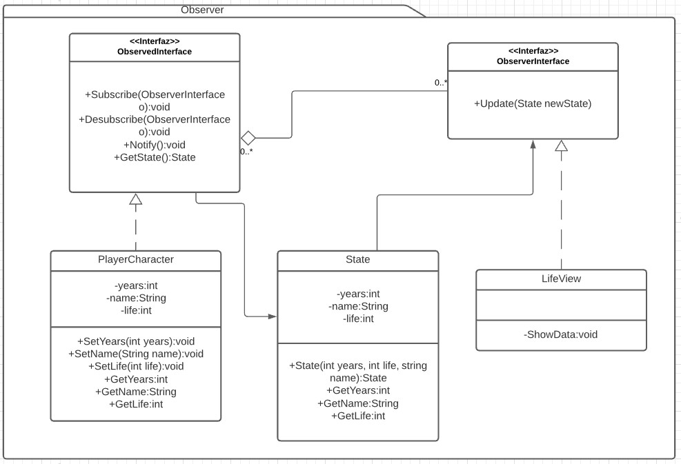

# Observer

Es un patron de comportamiento. [Link descripción](https://sourcemaking.com/design_patterns/observer)

El patrón observer permite a los implementadores de la interfaz observer suscribirse a sujetos y recibir notificaciones de actualización en el sujeto

## Diagrama uml

## SOLID

* Single responsibility

Un sujeto observador bien modelado tiene solo una responsabilidad, generalmente la de representar una entidad del modelo.

* Open/Closed principle

Este principio cierra bastante con el patrón aunque en general un observador debe conocer la implementación del sujeto observado o el observado debe devolver (como en este ejemplo) un StateObject con los datos modificados.

* Liskov substitution

Toda implementación de la interfaz observada u observer puede ser intercambiado cualquiera de la jerarquia y debería funcionar como si fuera el padre, no hay conflico con este principio.

* Interface segregation

Un buen modelado del patrón permite segregación de interfaces ya que solo estamos dependiendo de la interfaz observed/observer.

* Dependency inversion

El único problema que encuentro con este principio es que el observer debe recibir o un objeto estado (puede ser una interfaz, por supuesto.) o bien conocer la implementación del objeto observado para poder realizar las acciones pertinentes cuando se llame al método update.
